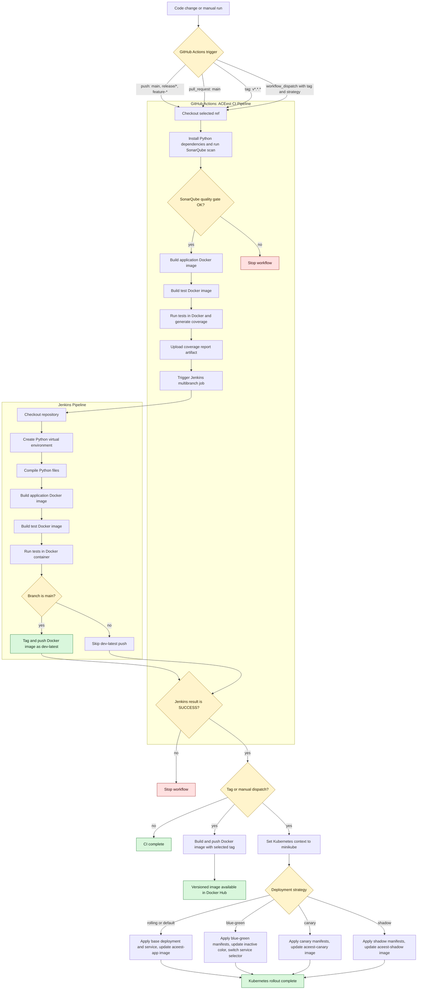

# CI/CD Pipeline Overview

This document describes the CI/CD flow implemented by:

- [`.github/workflows/main.yml`](.github/workflows/main.yml)
- [`Jenkinsfile`](Jenkinsfile)
- Kubernetes manifests under [`Deployment/`](Deployment/)

GitHub Actions is the main orchestrator. It performs the first CI checks, triggers Jenkins, waits for Jenkins to finish, and then runs release image publishing and Kubernetes deployment only for tag or manual deployment events.

## Pipeline Flow



## GitHub Actions Flow

The workflow runs for pushes to `main`, `release/*`, and `feature-*`, pull requests targeting `main`, tags matching `v*.*.*`, and manual `workflow_dispatch` runs.

The CI sequence is:

1. Checkout the requested ref. Manual runs use the provided tag; other runs use the GitHub ref.
2. Set up Python 3.12 and install `requirements.txt`.
3. Set up Java 17 and run SonarQube analysis for project key `aceest`.
4. Query the SonarQube quality gate and stop the workflow if it is not `OK`.
5. Build the application Docker image.
6. Build the test Docker image from `test.Dockerfile`.
7. Run tests in the Docker test container and generate coverage.
8. Upload `coverage.xml` and `htmlcov/` as the `coverage-report` artifact.
9. Trigger the Jenkins multibranch job for the current branch or ref name.
10. Poll Jenkins until the build finishes, and fail the GitHub Actions run unless Jenkins returns `SUCCESS`.

## Jenkins Flow

Jenkins performs an additional validation path after GitHub Actions has completed its own build and test jobs.

The Jenkins stages are:

1. Checkout repository source.
2. Create a Python virtual environment and install dependencies.
3. Compile Python files under `app/` with `python -m py_compile app/*.py`.
4. Build the application Docker image as `aceest-web-devops:latest`.
5. Build the test Docker image as `aceest-web-devops-test:latest`.
6. Run tests inside the test Docker container.
7. When the Jenkins branch is `main`, tag the application image as `plsphaniteja2024tm93573/aceest-web-app-2024tm93573:dev-latest` and push it to Docker Hub.

For non-`main` Jenkins branches, the `dev-latest` push stage is skipped.

## Release And Deployment Flow

After Jenkins succeeds, GitHub Actions only publishes the versioned image and deploys to Kubernetes when the run is either:

- a tag push such as `v1.2.3`
- a manual `workflow_dispatch` run with a selected `tag`

For tag pushes, the deployment strategy defaults to `rolling`. For manual runs, the selected `deployment_strategy` input is used.

The image publishing job and Kubernetes deployment job are both gated by Jenkins success and the tag/manual condition. They are independent jobs in the workflow, so the deployment job sets Kubernetes workloads to the selected tag while the release image job builds and pushes that same tag.

The release image is built and pushed as:

```text
plsphaniteja2024tm93573/aceest-web-app-2024tm93573:<tag>
```

The Kubernetes job uses the `minikube` context and supports these strategies:

| Strategy | Behavior |
| --- | --- |
| `rolling` | Applies the base deployment and service, updates `deployment/aceest-app`, then waits for rollout. |
| `blue-green` | Applies blue-green manifests, detects the current service color, updates the inactive deployment, waits for rollout, then patches `aceest-service` to the new color. |
| `canary` | Applies canary manifests, updates `deployment/aceest-canary`, then waits for rollout. |
| `shadow` | Applies shadow manifests, updates `deployment/aceest-shadow`, then waits for rollout. |

## Summary

| Path | Trigger | Main purpose | Image push |
| --- | --- | --- | --- |
| GitHub Actions CI | Branch push or PR | SonarQube, Docker build, tests, Jenkins orchestration | No versioned release push |
| Jenkins validation | Triggered by GitHub Actions | Independent environment setup, compile check, Docker build, tests | Pushes `dev-latest` only on `main` |
| GitHub Actions release | Tag or manual dispatch after Jenkins success | Build and publish selected release image | Pushes `<tag>` |
| Kubernetes deployment | Tag or manual dispatch after Jenkins success | Deploy selected image using rolling, blue-green, canary, or shadow strategy | Sets workloads to the `<tag>` image |
