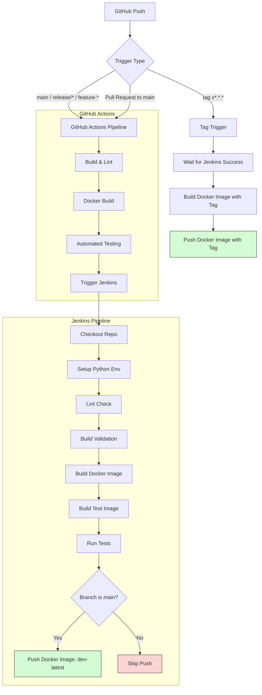

# 🚀 CI/CD Pipeline Overview

This document visualizes the complete CI/CD flow involving:

- GitHub Actions
- Jenkins Pipeline
- Docker build & push logic
- Branch vs Tag-based triggers

---

## 🔁 Pipeline Flow



---

## 📌 Key Behaviors

### 🔹 GitHub Actions Triggers
- Runs on:
  - `main`
  - `release/*`
  - `feature-*`
  - Pull Requests → `main`
  - Tags → `v*.*.*`

---

### 🔹 Jenkins Trigger
- Triggered **only after GitHub Actions succeeds**
- Uses branch name:
  ```
  ${{ github.head_ref || github.ref_name }}
  ```

---

### 🔹 Docker Push Logic

#### ✅ Jenkins Push (DEV)
- Condition: **branch = `main`**
- Tag:
  ```
  dev-latest
  ```

---

#### ✅ GitHub Actions Push (RELEASE)
- Condition: **Git tag (v*.*.*)**
- Tag:
  ```
  <git-tag>
  ```

---

### 🔥 Summary

| Pipeline         | Trigger Condition       | Docker Tag     | Purpose        |
|-----------------|------------------------|----------------|----------------|
| GitHub Actions  | Branch / PR / Tag      | (build only)   | CI validation  |
| Jenkins         | After GHA success      | dev-latest     | Dev deployment |
| GitHub Actions  | Tag (v*.*.*)           | version tag    | Release build  |

---

## 🧠 Architecture Insight

- **GitHub Actions = CI Orchestrator**
- **Jenkins = Deep validation + controlled deploy**
- **Tags = Release gate**
- **Main branch = Dev deployment**

---
